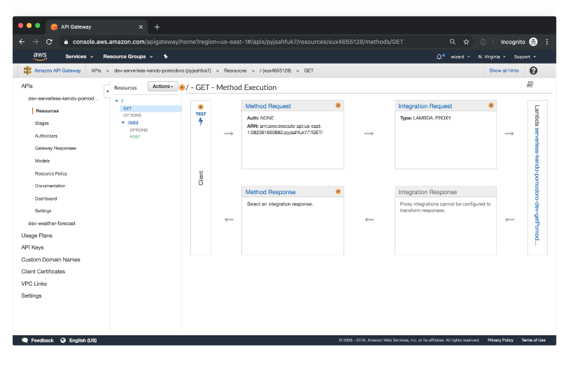
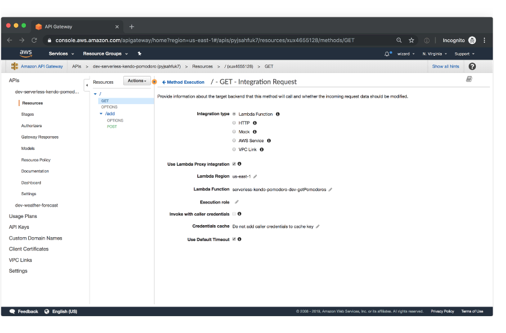
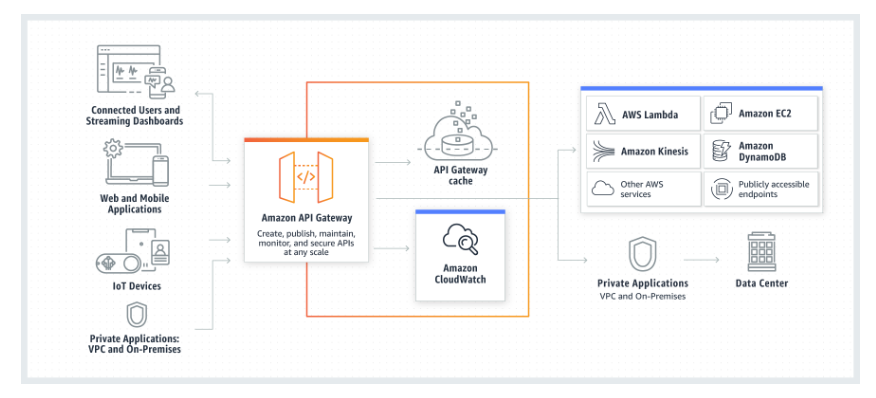

#  What is Amazon API Gateway?
- In this guide, we’ll walk you through all the details of API Gateway. We’ll show you how it can be used with the Serverless Framework and give you a list of resources should you want to learn even more.

- Recently, AWS also launched AWS HTTP APIs. These are a potential alternative to API Gateway REST APIs that we discuss in detail in our Ultimate Guide to AWS HTTP APIs.

- Amazon API Gateway is a managed service that allows developers to define the HTTP endpoints of a REST API or a WebSocket API and connect those endpoints with the corresponding backend business logic. It also handles authentication, access control, monitoring, and tracing of API requests.

- Many Serverless applications use Amazon API Gateway, which conveniently replaces the API servers with a managed serverless solution.

# How does API Gateway work?
- API Gateway sits between the backend services of your API and your API’s users, handling the HTTP requests to your API endpoints and routing them to the correct backends. It provides a set of tools that help you manage your API definitions and the mappings between endpoints and their respective backend services. It can also generate API references from your definitions and make them available to your users as API documentation.

- API Gateway integrates with many other AWS services like AWS Lambda, AWS SNS, AWS IAM, and Cognito Identity Pools. These integrations allow for fully managed authentication and authorization layers, as well as detailed metrics and tracing for API requests.

 The service’s graphical user interface allows you to sketch out the API structure and view the API flows in graphical form after they’ve been created.

While the user interface is a good way to try out API Gateway, we recommend creating your API structure in code, for example, using the Serverless Framework’s built-in API Gateway event.

## Why is API Gateway an essential part of the Serverless ecosystem?
- Within the Serverless ecosystem, API Gateway is the piece that ties together Serverless functions and API definitions. Being able to trigger the execution of a Serverless function directly in response to an HTTP request is the key reason why API Gateway is so valuable in Serverless setups: it enables a truly serverless architecture for web applications. When using API Gateway together with other AWS services, it’s possible to build a fully functional customer-facing web application without maintaining a single server yourself.

- This brings the advantages of the serverless model—scalability, low maintenance, and low cost due to low overhead—to mainstream web applications.

## How does API Gateway integrate with other AWS services?

- Many AWS services support integration with Amazon API Gateway, including:

    - AWS Lambda: run Lambda functions to generate HTTP API responses.

    - AWS SNS: publish SNS notifications when an HTTP API endpoint is accessed.

    - Amazon Cognito: provide authentication and authorization for your HTTP APIs.

API Gateway supports direct integrations that can be configured in the API Gateway user interface (or via the API Gateway’s own API) for the following actions:

- Invoking an AWS Lambda function.

- Invoking another HTTP endpoint, with or without VPC Link.

- Making an HTTP call against the API of any AWS service that provides an HTTP API.
Returning a mock response generated within API Gateway without calling out to other services.

You can also connect an HTTP endpoint created in API Gateway with a service that doesn’t offer a native integration. Perhaps the best way to achieve this is to set up an AWS Lambda function that contains all the business logic for the integration and then connect that Lambda function with an HTTP endpoint in API Gateway.

# How does API Gateway work with the Serverless Framework?

- The Serverless Framework uses a Lambda Proxy integration to make API Gateway events easily available to your Serverless functions. For example, for a simple HTTP API you would specify the API Gateway endpoint that you want attached to your Serverless function right in the serverless.yml file

# Benefits of Amazon API Gateway :

Using API Gateway to create HTTP APIs in AWS offers four main benefits:

Map HTTP requests to specific functions in a Serverless application via an API Gateway event. Connecting HTTP endpoints to individual functions is straightforward with API Gateway, obviating the need for a dedicated API server.

Map WebSocket events to Serverless functions. If you are building a WebSocket API, API Gateway also lets you map its events to a Serverless function. This works great for real-time functionality like in-app updates and notifications.

Use multiple microservices to serve the same top-level API. API Gateway makes it easy to have different Serverless functions serving different parts of your API. This means you can better encapsulate your functionality into each function and clearly separate the business logic of different parts of your API. Another benefit here is that you can transparently replace the function called by a given API request—the users won’t notice any change on the API layer.

Save time with integrations: authentication, developer portal, CloudTrail, CloudWatch. API Gateway allows you to implement a fully managed authentication and authorization layer by using Amazon Cognito and Lambda custom authorizers without running your own auth systems. By using API Gateway you also get access to the developer portals that are generated automatically from your API schemas. In addition, CloudTrail, CloudWatch and X-RAY all integrate with API Gateway, simplifying the profiling and debugging of API requests.

These benefits boil down to reducing your time to market for new HTTP APIs and increasing developer productivity, while also ensuring that the solutions your teams are building stay scalable.

# Drawbacks to Amazon API Gateway

There are a few caveats when using API Gateway that you should be aware of before using it in production. The main downside is added latency in your APIs: in certain cases, the service can add costly milliseconds to your response times. This issue is exacerbated by the fact that you can’t fine-tune API Gateway—it’s a managed service, and AWS doesn’t allow you to tweak the performance parameters.

That said, the impact on latency won’t be visible unless you are building truly low-latency applications or are combining many API layers. There aren’t many alternatives to API Gateway besides running your own API servers; running your own servers might well be worth it if you’re heading into latency-sensitive territory.

# What is API Gateway good for?

The main use case for Amazon API Gateway is in building serverless HTTP APIs. API Gateway stands in as your API server: managing the schema of your HTTP API, connecting each endpoint to the right backend service, and handling the concerns like authentication and throttling.

Amazon API Gateway is probably not the right choice if you’re looking for an ultra-low-latency HTTP request router or if you want a lot of control over how API requests are processed (in these cases, a custom solution may perform better), or if you are building a GraphQL API and would like to manage its schema (check out AWS AppSync for GraphQL APIs).
____

# Amazon API Gateway:

- Amazon API Gateway is a fully managed service that makes it easy for developers to create, publish, maintain, monitor, and secure APIs at any scale. APIs act as the "front door" for applications to access data, business logic, or functionality from your backend services. Using API Gateway, you can create RESTful APIs and WebSocket APIs that enable real-time two-way communication applications. API Gateway supports containerized and serverless workloads, as well as web applications.

- API Gateway handles all the tasks involved in accepting and processing up to hundreds of thousands of concurrent API calls, including traffic management, CORS support, authorization and access control, throttling, monitoring, and API version management. API Gateway has no minimum fees or startup costs. You pay for the API calls you receive and the amount of data transferred out and, with the API Gateway tiered pricing model, you can reduce your cost as your API usage scales.

## API Types:
 
- RESTful APIs:

Build RESTful APIs optimized for serverless workloads and HTTP backends using HTTP APIs. HTTP APIs are the best choice for building APIs that only require API proxy functionality. If your APIs require API proxy functionality and API management features in a single solution, API Gateway also offers.

- WEBSOCKET APIs:

Build real-time two-way communication applications, such as chat apps and streaming dashboards, with WebSocket APIs. API Gateway maintains a persistent connection to handle message transfer between your backend service and your clients.

___

# How API Gateway Works  : 

