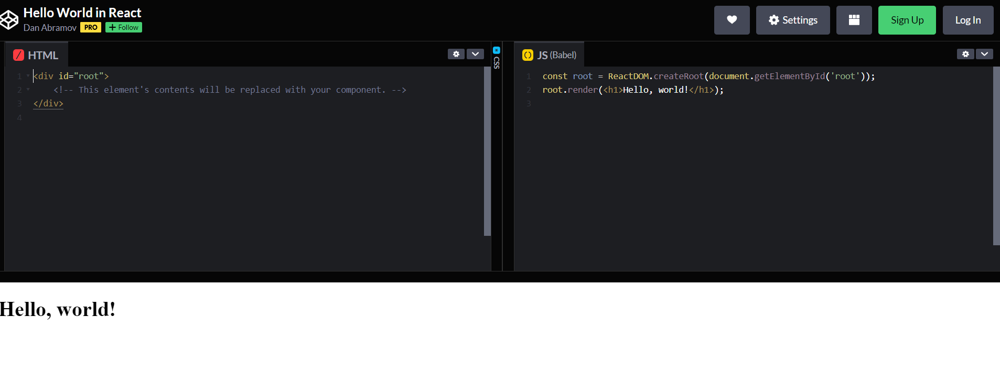

# Component Based UI :

## What Is React?

 - React is a declarative, efficient, and flexible JavaScript library for building user interfaces. It lets you compose complex UIs from small and isolated pieces of code called “components”.

 - "Hello World" :The smallest React example looks like this:

 

 ## Introducing JSX :

 Consider this variable declaration:
 ```js
 const element = <h1>Hello, world!</h1>;
 ```
 It is called JSX, and it is a syntax extension to JavaScript. We recommend using it with React to describe what the UI should look like. JSX may remind you of a template language, but it comes with the full power of JavaScript.

 ## Why JSX?
- React embraces the fact that rendering logic is inherently coupled with other UI logic: how events are handled, how the state changes over time, and how the data is prepared for display.

- Instead of artificially separating technologies by putting markup and logic in separate files, React separates concerns with loosely coupled units called “components” that contain both.

- React doesn’t require using JSX, but most people find it helpful as a visual aid when working with UI inside the JavaScript code. It also allows React to show more useful error and warning messages.

## Embedding Expressions in JSX :

In the example below, we declare a variable called name and then use it inside JSX by wrapping it in curly braces:
```js
const name = 'Josh Perez';
const element = <h1>Hello, {name}</h1>;
```

You can put any valid JavaScript expression inside the curly braces in JSX. For example, 2 + 2, user.firstName, or formatName(user) are all valid JavaScript expressions.

In the example below, we embed the result of calling a JavaScript function, formatName(user), into an <h1> element.

```js
function formatName(user) {
  return user.firstName + ' ' + user.lastName;
}

const user = {
  firstName: 'Harper',
  lastName: 'Perez'
};

const element = (
  <h1>
    Hello, {formatName(user)}!
  </h1>
);
```
## JSX is an Expression Too :

After compilation, JSX expressions become regular JavaScript function calls and evaluate to JavaScript objects.

This means that you can use JSX inside of if statements and for loops, assign it to variables, accept it as arguments, and return it from functions:

```js
function getGreeting(user) {
  if (user) {
    return <h1>Hello, {formatName(user)}!</h1>;
  }
  return <h1>Hello, Stranger.</h1>;
}
```
## Specifying Attributes with JSX

You may use quotes to specify string literals as attributes:
```js
const element = <a href="https://www.reactjs.org"> link </a>;
```
You may also use curly braces to embed a JavaScript expression in an attribute:
```js
const element = </img>;
```

## Specifying Children with JSX :

If a tag is empty, you may close it immediately with />, like XML:
```js
const element = ;
```

JSX tags may contain children:
```js
const element = (
  <div>
    <h1>Hello!</h1>
    <h2>Good to see you here.</h2>
  </div>
);
```
 
 ## JSX Prevents Injection Attacks :

It is safe to embed user input in JSX:
```js
const title = response.potentiallyMaliciousInput;
// This is safe:
const element = <h1>{title}</h1>;
```

## JSX Represents Objects :

Babel compiles JSX down to React.createElement() calls.

These two examples are identical:
```js
const element = (
  <h1 className="greeting">
    Hello, world!
  </h1>
);
```
```js
const element = React.createElement(
  'h1',
  {className: 'greeting'},
  'Hello, world!'
);
```

React.createElement() performs a few checks to help you write bug-free code but essentially it creates an object like this:

```js
// Note: this structure is simplified
const element = {
  type: 'h1',
  props: {
    className: 'greeting',
    children: 'Hello, world!'
  }
};
```