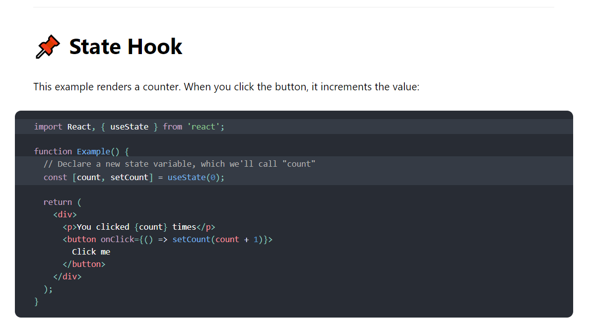
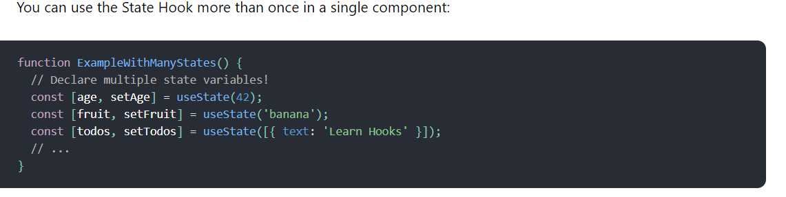

# Introducing Hooks

- Hooks are a new addition in React 16.8. They let you use state and other React features without writing a class.
```js
import React, { useState } from 'react';

function Example() {
  // Declare a new state variable, which we'll call "count"
  const [count, setCount] = useState(0);

  return (
    <div>
      <p>You clicked {count} times</p>
      <button onClick={() => setCount(count + 1)}>
        Click me
      </button>
    </div>
  );
}
```

##  Motivation
Hooks solve a wide variety of seemingly unconnected problems in React that we’ve encountered over five years of writing and maintaining tens of thousands of components. Whether you’re learning React, use it daily, or even prefer a different library with a similar component model, you might recognize some of these problems.

## It’s hard to reuse stateful logic between components

React doesn’t offer a way to “attach” reusable behavior to a component (for example, connecting it to a store). If you’ve worked with React for a while, you may be familiar with patterns like render props and higher-order components that try to solve this. But these patterns require you to restructure your components when you use them, which can be cumbersome and make code harder to follow. If you look at a typical React application in React DevTools, you will likely find a “wrapper hell” of components surrounded by layers of providers, consumers, higher-order components, render props, and other abstractions. While we could filter them out in DevTools, this points to a deeper underlying problem: React needs a better primitive for sharing stateful logic.

With Hooks, you can extract stateful logic from a component so it can be tested independently and reused. Hooks allow you to reuse stateful logic without changing your component hierarchy. This makes it easy to share Hooks among many components or with the community.


______
## Complex components become hard to understand
-  We’ve often had to maintain components that started out simple but grew into an unmanageable mess of stateful logic and side effects. Each lifecycle method often contains a mix of unrelated logic. For example, components might perform some data fetching in componentDidMount and componentDidUpdate. However, the same componentDidMount method might also contain some unrelated logic that sets up event listeners, with cleanup performed in componentWillUnmount. Mutually related code that changes together gets split apart, but completely unrelated code ends up combined in a single method. This makes it too easy to introduce bugs and inconsistencies.

- In many cases it’s not possible to break these components into smaller ones because the stateful logic is all over the place. It’s also difficult to test them. This is one of the reasons many people prefer to combine React with a separate state management library. However, that often introduces too much abstraction, requires you to jump between different files, and makes reusing components more difficult.

- To solve this, Hooks let you split one component into smaller functions based on what pieces are related (such as setting up a subscription or fetching data), rather than forcing a split based on lifecycle methods. You may also opt into managing the component’s local state with a reducer to make it more predictable.

____
## Hooks at a Glance
Hooks are a new addition in React 16.8. They let you use state and other React features without writing a class.

- Here, useState is a Hook (we’ll talk about what this means in a moment). We call it inside a function component to add some local state to it. React will preserve this state between re-renders. useState returns a pair: the current state value and a function that lets you update it. You can call this function from an event handler or somewhere else. It’s similar to this.setState in a class, except it doesn’t merge the old and new state together. (We’ll show an example comparing useState to this.state in Using the State Hook.)

- The only argument to useState is the initial state. In the example above, it is 0 because our counter starts from zero. Note that unlike this.state, the state here doesn’t have to be an object — although it can be if you want. The initial state argument is only used during the first render.



- The array destructuring syntax lets us give different names to the state variables we declared by calling useState. These names aren’t a part of the useState API. Instead, React assumes that if you call useState many times, you do it in the same order during every render. We’ll come back to why this works and when this is useful later.

## what is a Hook?
- Hooks are functions that let you “hook into” React state and lifecycle features from function components. Hooks don’t work inside classes — they let you use React without classes. (We don’t recommend rewriting your existing components overnight but you can start using Hooks in the new ones if you’d like.)

- React provides a few built-in Hooks like useState. You can also create your own Hooks to reuse stateful behavior between different components. We’ll look at the built-in Hooks first.

## Rules of Hooks
Hooks are JavaScript functions, but they impose two additional rules:

- Only call Hooks at the top level. Don’t call Hooks inside loops, conditions, or nested functions.

- Only call Hooks from React function components. Don’t call Hooks from regular JavaScript functions. (There is just one other valid place to call Hooks — your own custom Hooks. We’ll learn about them in a moment.)

We provide a linter plugin to enforce these rules automatically. We understand these rules might seem limiting or confusing at first, but they are essential to making Hooks work well.

