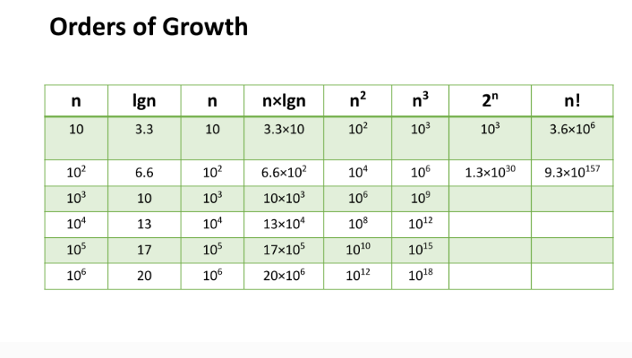

## Big O: Analysis of Algorithm Efficiency

1- Big O(oh) notation is used to describe the efficiency of an algorithm or function. This efficiency is evaluated based on Complexity (Running Time ,Memory Space).

2-. In order to analyze  factors of complixety, we should consider 4 Key Areas for analysis:

- Input Size:

   -Input Size refers to the size of the parameter values that are read by the algorithm. 

- Units of Measurement:

    1-To evaluate a function for Time and Space complexity, we need a way to measure each of these factors.

    2-In order to quantify the Running Time in our analysis, we will consider Three Measurements of time:
     
     - The time in milliseconds from the start of a function execution until it ends.

     - The number of operations that are executed.  
     - The number of “Basic Operations” that are executed.  

- Orders of Growth:

 We can describe overall efficiency by using the input size n and measuring the overall Units of Space and Time required for the given input size n. As the value of n grows, the Order of Growth represents the increase in Running Time or Memory Space.

- Best Case, Worst Case, and Average Case:

  - Worst Case: The efficiency for the worst possible input of size n
This case runs the longest for all possible inputs of n. This assumes that if we were sorting values, inputs are completely unsorted and searched values either don’t exist or are at the last to be searched.

  - Best Case: The efficiency for the best possible input of size n
This case runs the quickest for all possible inputs of n. In the case of sorting, this assumes that values are sorted, and so searched-for values are easy to find.

  - Average Case: The efficiency for a “typical” or “random” input of size n.
The average case makes a typical assumption about the possible inputs of size ‘n’ and how they might affect efficiency. This is NOT the best case and worst case averaged together.

___
## Linked Lists:

1- A Linked List is a sequence of Nodes that are connected/linked to each other. The most defining feature of a Linked List is that each Node references the next Node in the link.

2-There are two types of Linked List

- Singly - Singly refers to the number of references the node has. A Singly linked list means that there is only one reference, and the reference points to the Next node in a linked list.

- Doubly - Doubly refers to there being two (double) references within the node. A Doubly linked list means that there is a reference to both the Next and Previous node.

___
## Linear data structures:

- One characteristic of linked lists is that they are linear data structures, which means that there is a sequence and an order to how they are constructed and traversed. We can think of a linear data structure like a game of hopscotch: in order to get to the end of the list, we have to go through all of the items in the list in order, or sequentially. Linear structures, however, are the opposite of non-linear structures. In non-linear data structures, items don’t have to be arranged in order, which means that we could traverse the data structure non-sequentially.

___
## Parts of a linked list:
A linked list can be small or huge, but no matter the size, the parts that make it up are actually fairly simple. A linked list is made up of a series of nodes, which are the elements of the list.
 