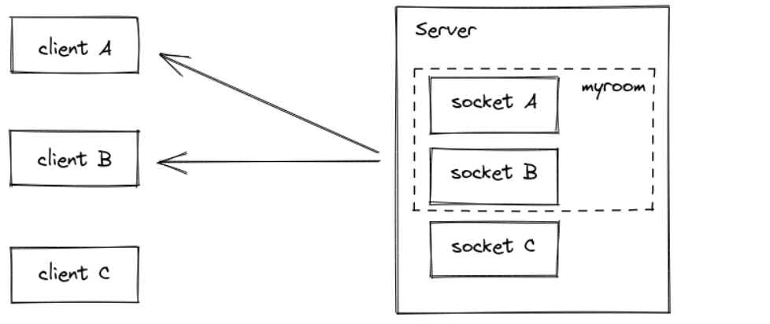
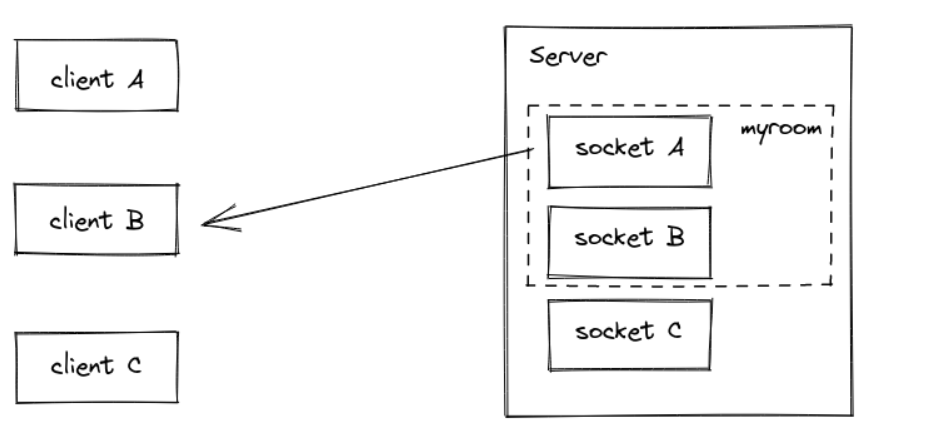
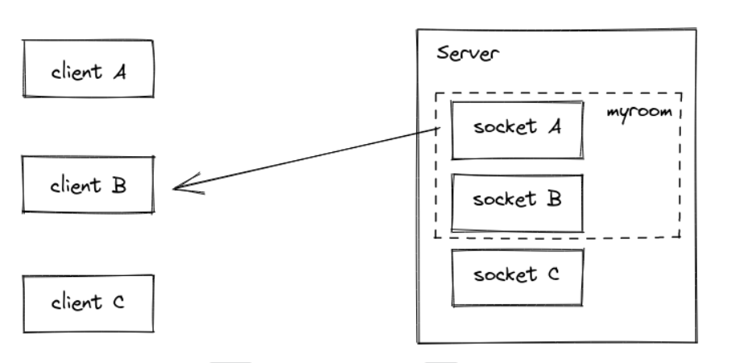
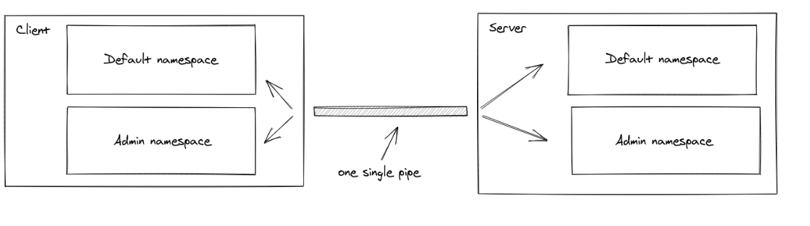

### Message Queues
## Rooms : 
- A room is an arbitrary channel that sockets can join and leave. It can be used to broadcast events to a subset of clients:


- Joining and leaving

  -You can call join to subscribe the socket to a given channel:
```js
io.on("connection", (socket) => {
  socket.join("some room");
});
```

     - And then simply use to or in (they are the same) when broadcasting or emitting:
    
  ```js
   io.to("some room").emit("some event");
  ```

     - You can emit to several rooms at the same time:
```js
io.to("room1").to("room2").to("room3").emit("some event");
```

    - In that case, a union is performed: every socket that is at least in one of the rooms will get the event once (even if the socket is in two or more rooms).

    -You can also broadcast to a room from a given socket:
```js
io.on("connection", (socket) => {
  socket.to("some room").emit("some event");
});
```

    - In that case, every socket in the room excluding the sender will get the event.

    



- Joining and leaving

     - You can call join to subscribe the socket to a given channel:
```js
io.on("connection", (socket) => {
  socket.join("some room");
});
```


    - And then simply use to or in (they are the same) when broadcasting or emitting:
```js
io.to("some room").emit("some event");
```

     - You can emit to several rooms at the same time:
```js
io.to("room1").to("room2").to("room3").emit("some event");
```

     - In that case, a union is performed: every socket that is at least in one of the rooms will get the event once (even if the socket is in two or more rooms).
   
    - You can also broadcast to a room from a given socket:

```js
io.on("connection", (socket) => {
  socket.to("some room").emit("some event");
});
```

     - In that case, every socket in the room excluding the sender will get the event.


 

 - Default room
       
    - Each Socket in Socket.IO is identified by a random, unguessable, unique identifier Socket#id. For your convenience, each socket automatically joins a room identified by its own id.

     - This makes it easy to implement private messages:
```js
io.on("connection", (socket) => {
  socket.on("private message", (anotherSocketId, msg) => {
    socket.to(anotherSocketId).emit("private message", socket.id, msg);
  });
});
```


- Sample use cases

   - broadcast data to each device / tab of a given 
   user
```js
io.on("connection", async (socket) => {
  const userId = await fetchUserId(socket);

  socket.join(userId);

  // and then later
  io.to(userId).emit("hi");
});
```

     - send notifications about a given entity
```js
io.on("connection", async (socket) => {
  const projects = await fetchProjects(socket);

  projects.forEach(project => socket.join("project:" + project.id));

  // and then later
  io.to("project:4321").emit("project updated");
});
```

- Disconnection

   - Upon disconnection, sockets leave all the channels they were part of automatically, and no special teardown is needed on your part.

   - You can fetch the rooms the Socket was in by listening to the disconnecting event:
```js
io.on("connection", socket => {
  socket.on("disconnecting", () => {
    console.log(socket.rooms); // the Set contains at least the socket ID
  });

  socket.on("disconnect", () => {
    // socket.rooms.size === 0
  });
});
```
___
## Namespaces
  - A Namespace is a communication channel that allows you to split the logic of your application over a single shared connection (also called "multiplexing").



- Namespace diagram

- Introduction
      -  Each namespace has its own:
     
      -    event handlers
```js
io.of("/orders").on("connection", (socket) => {
  socket.on("order:list", () => {});
  socket.on("order:create", () => {});
});

io.of("/users").on("connection", (socket) => {
  socket.on("user:list", () => {});
});
```

    - rooms
```js
const orderNamespace = io.of("/orders");

orderNamespace.on("connection", (socket) => {
  socket.join("room1");
  orderNamespace.to("room1").emit("hello");
});

const userNamespace = io.of("/users");

userNamespace.on("connection", (socket) => {
  socket.join("room1"); // distinct from the room in the "orders" namespace
  userNamespace.to("room1").emit("holà");
});
```

  - middlewares
```js
const orderNamespace = io.of("/orders");

orderNamespace.use((socket, next) => {
  // ensure the socket has access to the "orders" namespace, and then
  next();
});

const userNamespace = io.of("/users");

userNamespace.use((socket, next) => {
  // ensure the socket has access to the "users" namespace, and then
  next();
});
``` 

 - Possible use cases:

 -you want to create a special namespace that only authorized users have access to, so the logic related to those users is separated from the rest of the application

```js
const adminNamespace = io.of("/admin");

adminNamespace.use((socket, next) => {
  // ensure the user has sufficient rights
  next();
});

adminNamespace.on("connection", socket => {
  socket.on("delete user", () => {
    // ...
  });
});
```

-your application has multiple tenants so you want to dynamically create one namespace per tenant

```js
const workspaces = io.of(/^\/\w+$/);

workspaces.on("connection", socket => {
  const workspace = socket.nsp;

  workspace.emit("hello");
});
```

- Main namespace
-Until now, you interacted with the main namespace, called /. The io instance inherits all of its methods:
```js
io.on("connection", (socket) => {});
io.use((socket, next) => { next() });
io.emit("hello");
// are actually equivalent to
io.of("/").on("connection", (socket) => {});
io.of("/").use((socket, next) => { next() });
io.of("/").emit("hello");
```

-Some tutorials may also mention io.sockets, it's simply an alias for io.of("/").

```js
io.sockets === io.of("/")
```
_____