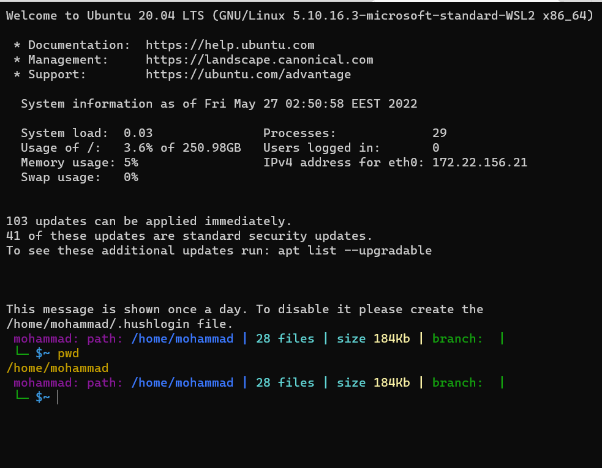
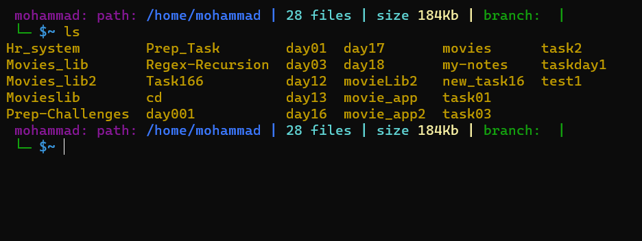
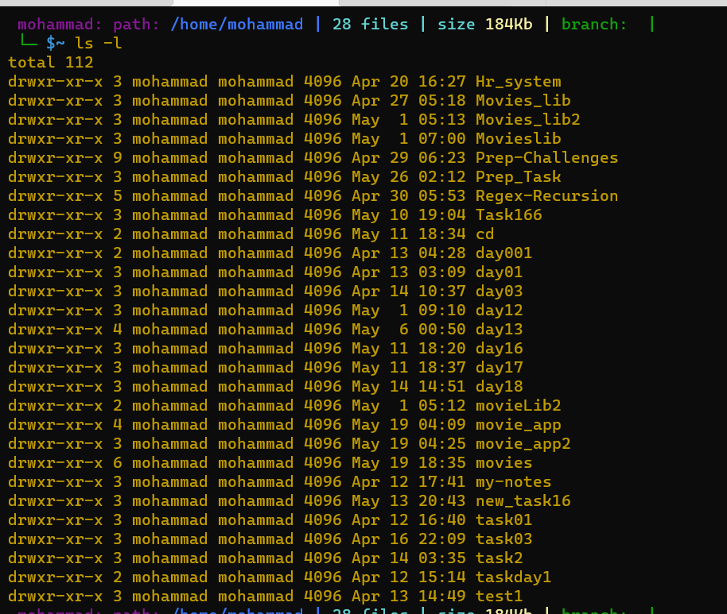
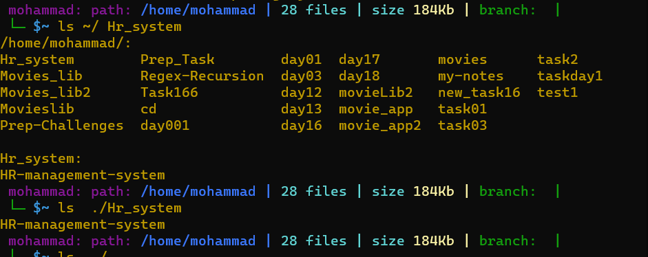
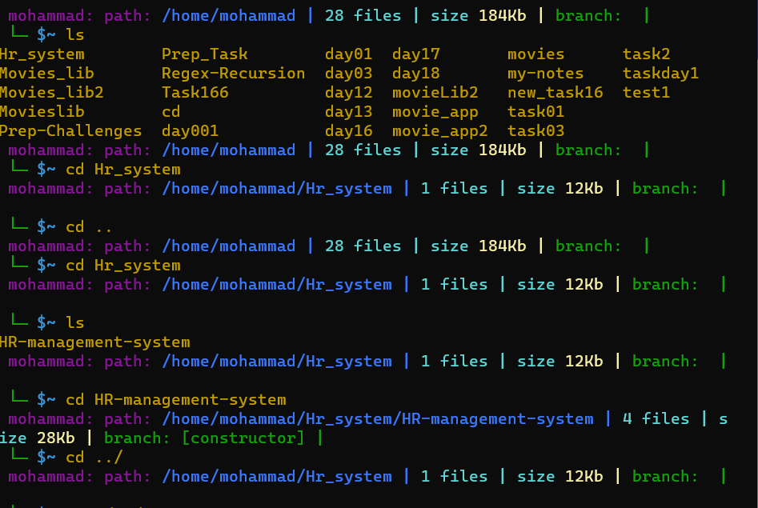
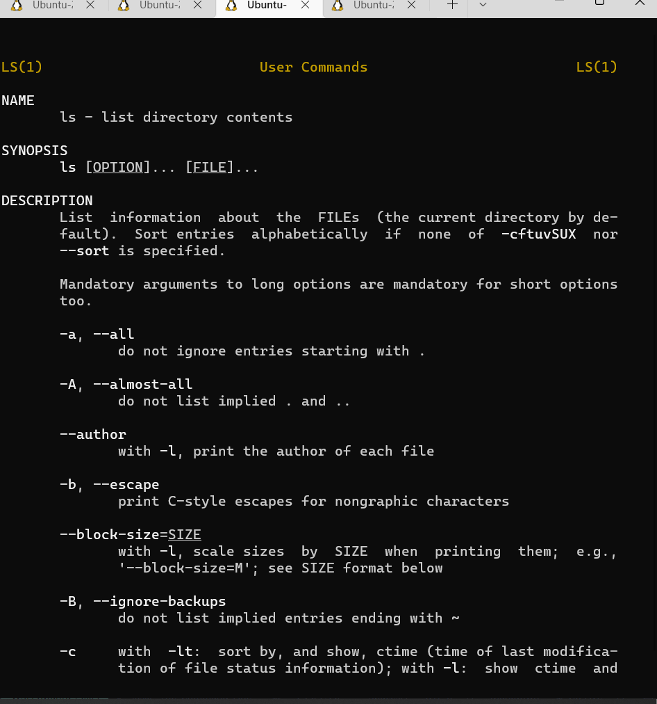
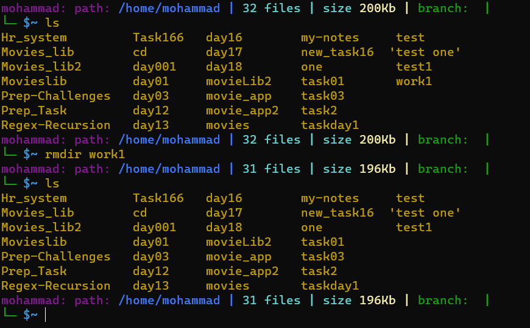
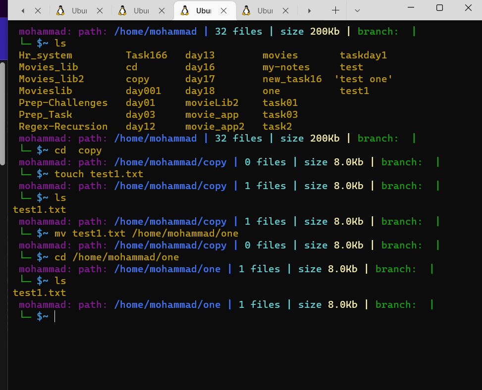

 ##  What is The Command Line ?  How does it work and how do I get to one ?

 The Command Line  is a text based interface to the system. You are able to enter commands by typing them on the keyboard and feedback will be given to you similarly as text.

 
The command line is an interesting beast, and if you've not used one before, can be a bit daunting  with a bit of practice you'll soon come to see it as your friend.

 
This is my  terminal page 
One of the Command Line commands is applied "ls".

</li> 

## Basic Navigation :

1-command"pwd" which stands for Print Working Directory:
  - The command does just that. It tells you what your current or present working directory is. Give it a try now.

2- command "ls"  It liste the contents of a  directory.

3- command "ls -l"  It liste the contents of a  directory with most information.
 
 - First character indicates whether it is a normal file ( - ) or directory ( d )

- Next 9 characters are permissions for the file or directory

- The next field is the number of blocks

- The next field is the owner of the file or directory

- The next field is the group the file or directory

- Following this is the file size.

- Next up is the file modification time.

- Finally we have the actual name of the file or directory.

4- command " ls/etc "  When we do this it tells ls not to list our current directory but instead to list that directories contents.
  

5- command " ls -l /etc "  :
  

6-  command " ls name of directory" and " ls path of directory" :
 

7-  command " ls ~/nameofdirectory" and " ls ./nameofdirectory" :
 

8-  command " cd" " to Change Directories  move to another directory. :
 

</li> 

## More About Files:

 - Everything is a file under Linux
     Even directories.

 - Linux is an extensionless system
Files can have any extension they like or none at all.

 - Linux is case sensitive
Beware of silly typos. 

- command "ls -a"
List the contents of a directory, including hidden files.
 

</li> 

 ## Manual Pages:

 - The manual pages are a set of pages that explain every command available on your system including what they do, the specifics of how you run them and what command line arguments they accept.
 

</li> 

 ## How to make, remove, rename, copy and move files and directories?
  - make directory:
   

  - Remove directory:
  

  - Move file:
  

