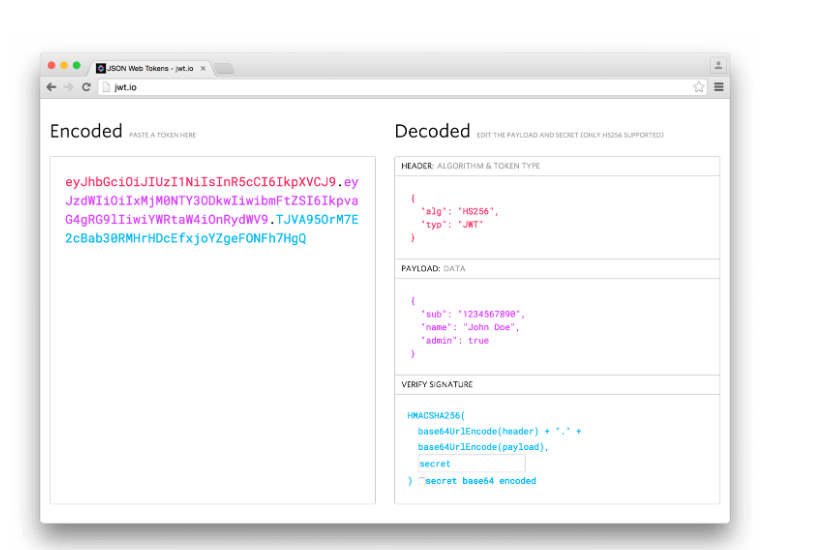
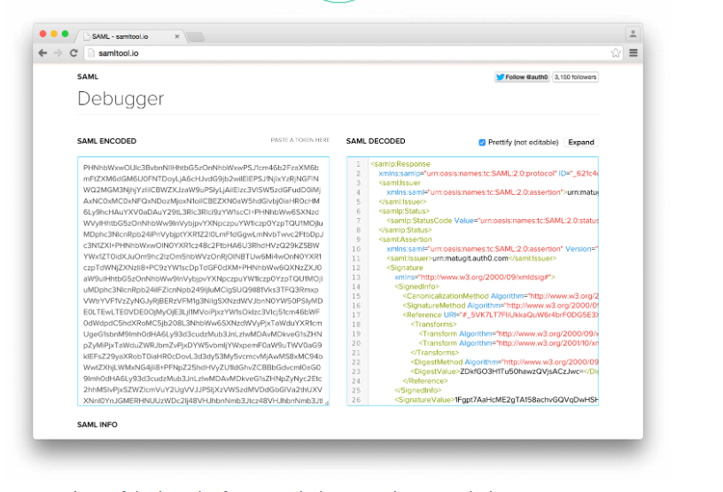

 
 ## What is JSON Web Token?
JSON Web Token (JWT) is an open standard (RFC 7519) that defines a compact and self-contained way for securely transmitting information between parties as a JSON object. This information can be verified and trusted because it is digitally signed. JWTs can be signed using a secret (with the HMAC algorithm) or a public/private key pair using RSA or ECDSA.

## When should you use JSON Web Tokens?


 - Authorization: This is the most common scenario for using JWT. Once the user is logged in, each subsequent request will include the JWT, allowing the user to access routes, services, and resources that are permitted with that token. 

- Information Exchange: JSON Web Tokens are a good way of securely transmitting information between parties. Because JWTs can be signed—for example, using public/private key pairs—you can be sure the senders are who they say they are. Additionally, as the signature is calculated using the header and the payload, you can also verify that the content hasn't been tampered with.

## What is the JSON Web Token structure?

1-Header:

The header typically consists of two parts: the type of the token, which is JWT, and the signing algorithm being used, such as HMAC SHA256 or RSA.
 ```js
 {
  "alg": "HS256",
  "typ": "JWT"
}
 ```

2-Payload:

The second part of the token is the payload, which contains the claims. Claims are statements about an entity (typically, the user) and additional data. There are three types of claims:

- Registered claims: These are a set of predefined claims which are not mandatory but recommended, to provide a set of useful, interoperable claims. Some of them are: iss (issuer), exp (expiration time), sub (subject).

-  Public claims: These can be defined at will by those using JWTs. But to avoid collisions they should be defined in the IANA JSON Web Token Registry or be defined as a URI that contains a collision resistant namespace.

- Private claims: These are the custom claims created to share information between parties that agree on using them and are neither registered or public claims.

```js
{
  "sub": "1234567890",
  "name": "John Doe",
  "admin": true
}
```

3-Signature:

To create the signature part you have to take the encoded header, the encoded payload, a secret, the algorithm specified in the header, and sign that.

For example if you want to use the HMAC SHA256 algorithm, the signature will be created in the following way:
```
HMACSHA256(
  base64UrlEncode(header) + "." +
  base64UrlEncode(payload),
  secret)

```

## How do JSON Web Tokens work?

In authentication, when the user successfully logs in using their credentials, a JSON Web Token will be returned. Since tokens are credentials, great care must be taken to prevent security issues. In general, you should not keep tokens longer than required.
You also should not store sensitive session data in browser storage due to lack of security.
Whenever the user wants to access a protected route or resource, the user agent should send the JWT, typically in the Authorization header using the Bearer schema. The content of the header should look like the following:
```
Authorization: Bearer <token>
```
## Why should we use JSON Web Tokens?
Security-wise, SWT can only be symmetrically signed by a shared secret using the HMAC algorithm. However, JWT and SAML tokens can use a public/private key pair in the form of a X.509 certificate for signing. Signing XML with XML Digital Signature without introducing obscure security holes is very difficult when compared to the simplicity of signing JSON.
JSON parsers are common in most programming languages because they map directly to objects. Conversely, XML doesn't have a natural document-to-object mapping. This makes it easier to work with JWT than SAML assertions.
Regarding usage, JWT is used at Internet scale. This highlights the ease of client-side processing of the JSON Web token on multiple platforms, especially mobile.

-Comparison of the length of an encoded JWT and an encoded SAML:


