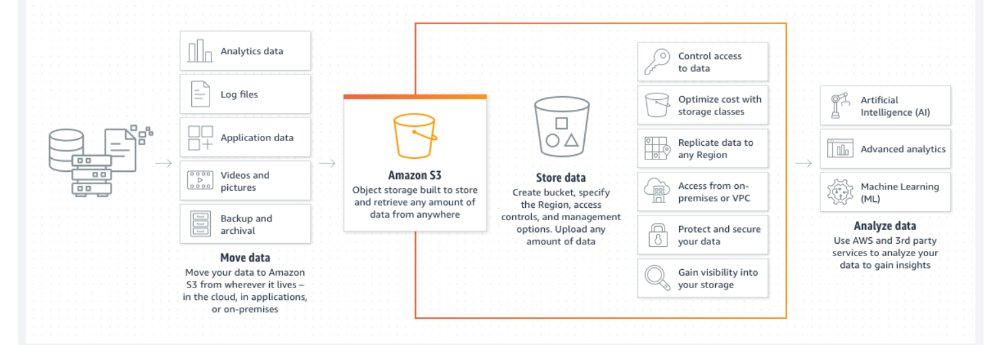

# AWS: S3 and Lambda :

## Amazon S3 : 
 
 - Object storage built to retrieve any amount of data from anywhere.
 

- How it works?

   - Amazon Simple Storage Service (Amazon S3) is an object storage service offering industry-leading scalability, data availability, security, and performance. Customers of all sizes and industries can store and protect any amount of data for virtually any use case, such as data lakes, cloud-native applications, and mobile apps. With cost-effective storage classes and easy-to-use management features, you can optimize costs, organize data, and configure fine-tuned access controls to meet specific business, organizational, and compliance requirements.
 

- Use cases :

  1- Build a data lake :

   Run big data analytics, artificial intelligence (AI), machine learning (ML), and high performance computing (HPC) applications to unlock data insights.

   2-Back up and restore critical data:
     
     Meet Recovery Time Objectives (RTO), Recovery Point Objectives (RPO), and compliance requirements with S3’s robust replication features.

   3-Archive data at the lowest cost:
  
    Move data archives to the Amazon S3 Glacier storage classes to lower costs, eliminate operational complexities, and gain new insights.

    4-Run cloud-native applications:

    Build fast, powerful mobile and web-based cloud-native apps 
    
    that scale automatically in a highly available configuration.
    
    
______

##  AWS Lambda :

   -  What is AWS Lambda?

        - AWS Lambda is a serverless computing service provided by Amazon Web Services (AWS). Users of AWS Lambda create functions, self-contained applications written in one of the supported languages and runtimes, and upload them to AWS Lambda, which executes those functions in an efficient and flexible manner.

       -  The Lambda functions can perform any kind of computing task, from serving web pages and processing streams of data to calling APIs and integrating with other AWS services.

       - The concept of “serverless” computing refers to not needing to maintain your own servers to run these functions. AWS Lambda is a fully managed service that takes care of all the infrastructure for you. And so “serverless” doesn’t mean that there are no servers involved: it just means that the servers, the operating systems, the network layer and the rest of the infrastructure have already been taken care of, so that you can focus on writing application code.

- How does AWS Lambda work?

   - Each Lambda function runs in its own container. When a function is created, Lambda packages it into a new container and then executes that container on a multi-tenant cluster of machines managed by AWS. Before the functions start running, each function’s container is allocated its necessary RAM and CPU capacity. Once the functions finish running, the RAM allocated at the beginning is multiplied by the amount of time the function spent running. The customers then get charged based on the allocated memory and the amount of run time the function took to complete.

  - The entire infrastructure layer of AWS Lambda is managed by AWS. Customers don’t get much visibility into how the system operates, but they also don’t need to worry about updating the underlying machines, avoiding network contention, and so on—AWS takes care of this itself.

  - And since the service is fully managed, using AWS Lambda can save you time on operational tasks. When there is no infrastructure to maintain, you can spend more time working on the application code—even though this also means you give up the flexibility of operating your own infrastructure.

  - One of the distinctive architectural properties of AWS Lambda is that many instances of the same function, or of different functions from the same AWS account, can be executed concurrently. Moreover, the concurrency can vary according to the time of day or the day of the week, and such variation makes no difference to Lambda—you only get charged for the compute your functions use. This makes AWS Lambda a good fit for deploying highly scalable cloud computing solutions.

## Why is AWS Lambda an essential part of the Serverless architecture?

- When building Serverless applications, AWS Lambda is one of the main candidates for running the application code. Typically, to complete a Serverless stack you’ll need:

    - a computing service;
    - a database service; and
    - an HTTP gateway service.

- Lambda fills the primary role of the compute service on AWS. It also integrates with many other AWS services and, together with API Gateway, DynamoDB and RDS, forms the basis for Serverless solutions for those using AWS. Lambda supports many of the most popular languages and runtimes, so it’s a good fit for a wide range of Serverless developers.

- What are the most common use cases for AWS Lambda?

  - Due to Lambda’s architecture, it can deliver great benefits over traditional cloud computing setups for applications where:

    1-individual tasks run for a short time;

    2-each task is generally self-contained;

    3-there is a large difference between the lowest and highest levels in the workload of the application.

- Some of the most common use cases for AWS Lambda that fit these criteria are:
Scalable APIs. When building APIs using AWS Lambda, one execution of a Lambda function can serve a single HTTP request. Different parts of the API can be routed to different Lambda functions via Amazon API Gateway. AWS Lambda automatically scales individual functions according to the demand for them, so different parts of your API can scale differently according to current usage levels. This allows for cost-effective and flexible API setups.
‍
- Data processing. Lambda functions are optimized for event-based data processing. It is easy to integrate AWS Lambda with datasources like Amazon DynamoDB and trigger a Lambda function for specific kinds of data events. For example, you could employ Lambda to do some work every time an item in DynamoDB is created or updated, thus making it a good fit for things like notifications, counters and analytics.

___