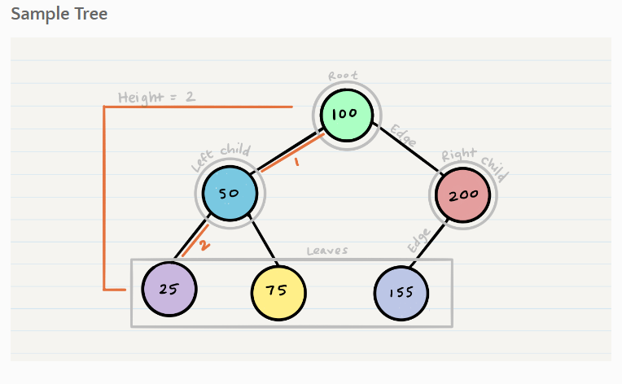
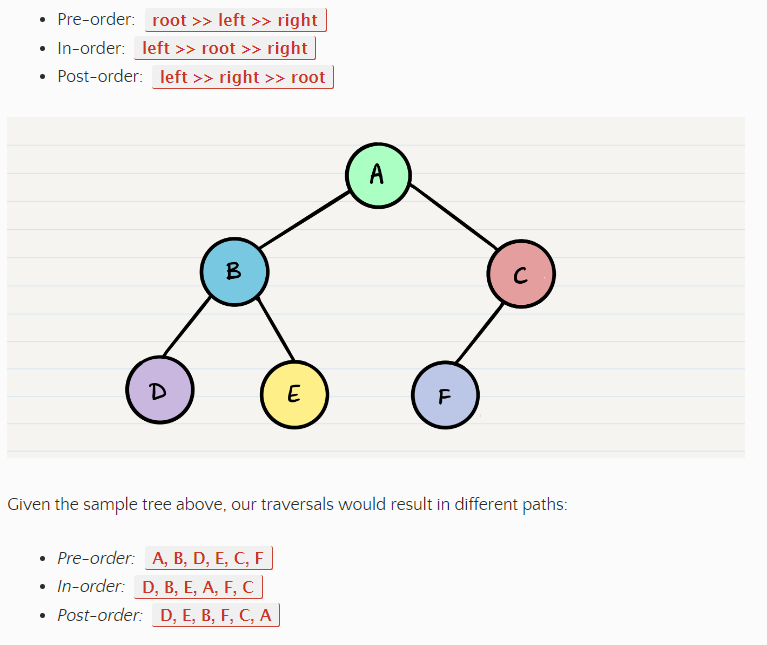
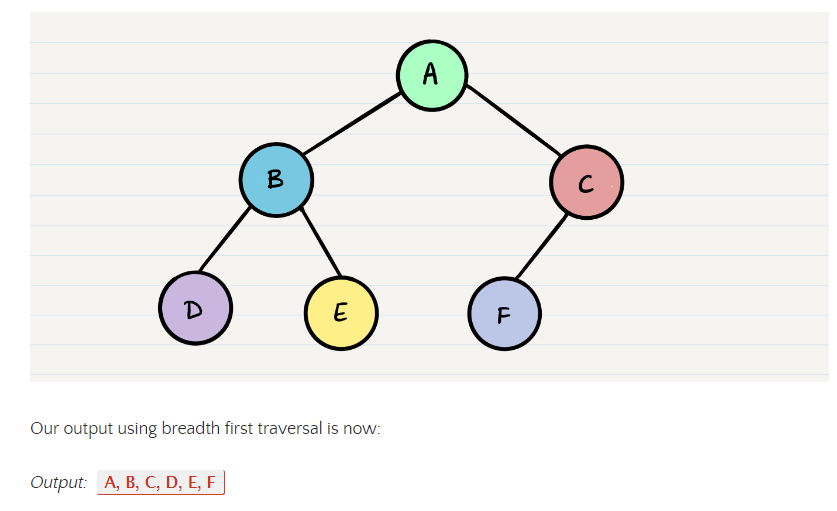
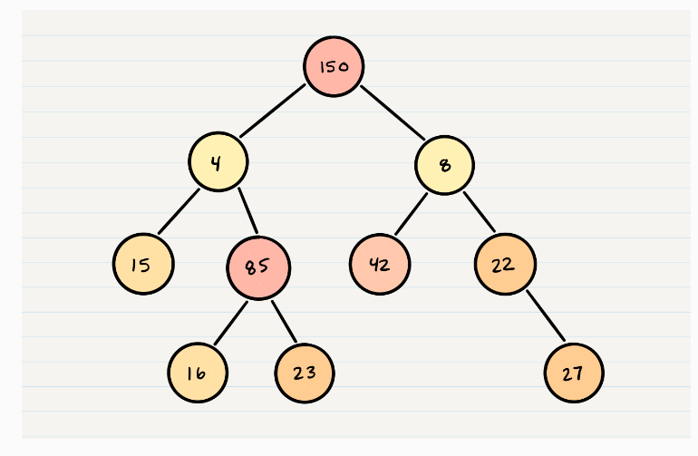
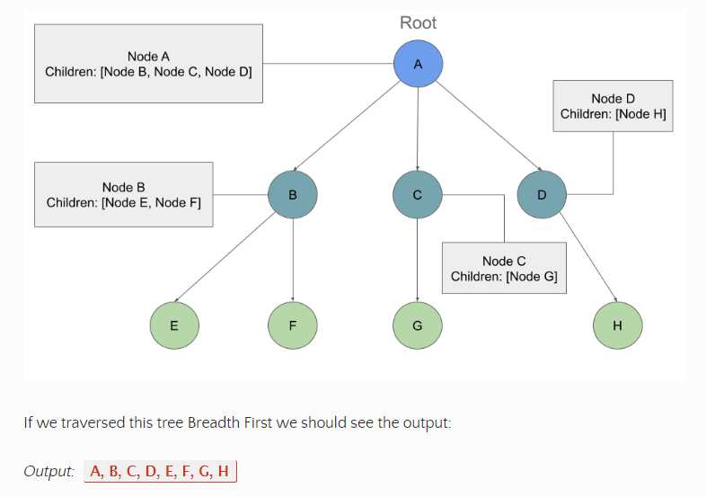
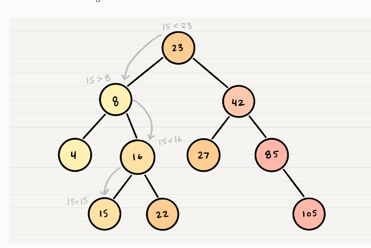

## Trees

 ### Common Terminology :
-  Node - A Tree node is a component which may contain its own values, and references to other nodes.

-  Root - The root is the node at the beginning of the tree.

- K - A number that specifies the maximum number of children any node may have in a k-ary tree. In a binary tree, k = 2.

- Left - A reference to one child node, in a binary tree. 

- Right - A reference to the other child node, in a binary tree

- Edge - The edge in a tree is the link between a parent and child node

- Leaf - A leaf is a node that does not have any children.
- Height - The height of a tree is the number of edges from the root to the furthest leaf

 
 ___
 ## Traversals
An important aspect of trees is how to traverse them. Traversing a tree allows us to search for a node, print out the contents of a tree, and much more! There are two categories of traversals when it comes to trees:

1- Depth First

2- Breadth First

##  1- Depth First
Depth first traversal is where we prioritize going through the depth (height) of the tree first. There are multiple ways to carry out depth first traversal, and each method changes the order in which we search/print the root. Here are three methods for depth first traversal:

- Pre-order: root >> left >> right
- In-order: left >> root >> right
- Post-order: left >> right >> root
 
 EX:
 
 ___

 ## Breadth First
Breadth first traversal iterates through the tree by going through each level of the tree node-by-node. So, given our starting tree one more time:
EX:

___
## Binary Tree Vs K-ary Trees: 

In all of our examples, we’ve been using a Binary Tree. Trees can have any number of children per node, but Binary Trees restrict the number of children to two (hence our left and right children).

There is no specific sorting order for a binary tree. Nodes can be added into a binary tree wherever space allows. Here is what a binary tree looks like:

  
  K-ary Trees
If Nodes are able have more than 2 child nodes, we call the tree that contains them a K-ary Tree. In this type of tree we use K to refer to the maximum number of children that each Node is able to have.

Breadth First Traversal
Traversing a K-ary tree requires a similar approach to the breadth first traversal. We are still pushing nodes into a queue, but we are now moving down a list of children of length k, instead of checking for the presence of a left and a right child.

___
## Binary Search Trees
A Binary Search Tree (BST) is a type of tree that does have some structure attached to it. In a BST, nodes are organized in a manner where all values that are smaller than the root are placed to the left, and all values that are larger than the root are placed to the right.

Here is how we would change our Binary Tree example into a Binary Search Tree:
- Let’s say we are searching 15. We start by comparing the value 15 to the value of the root, 23.
 